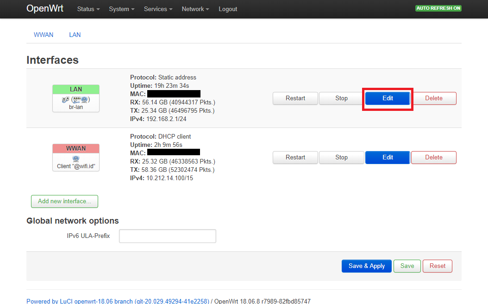
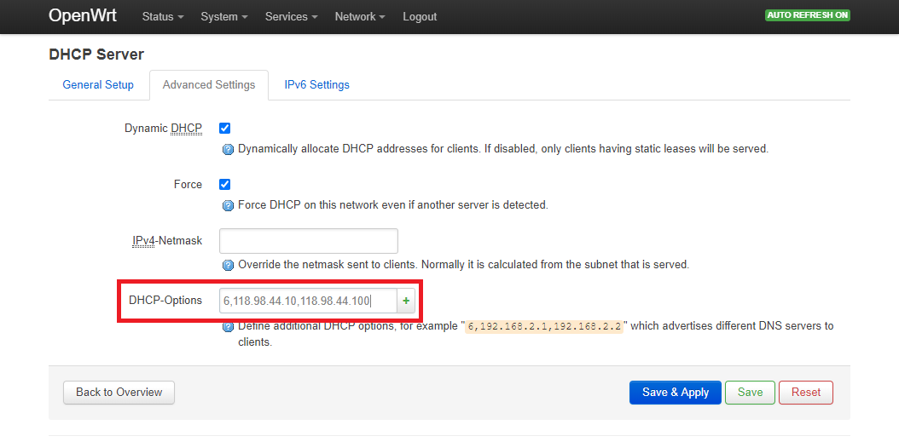
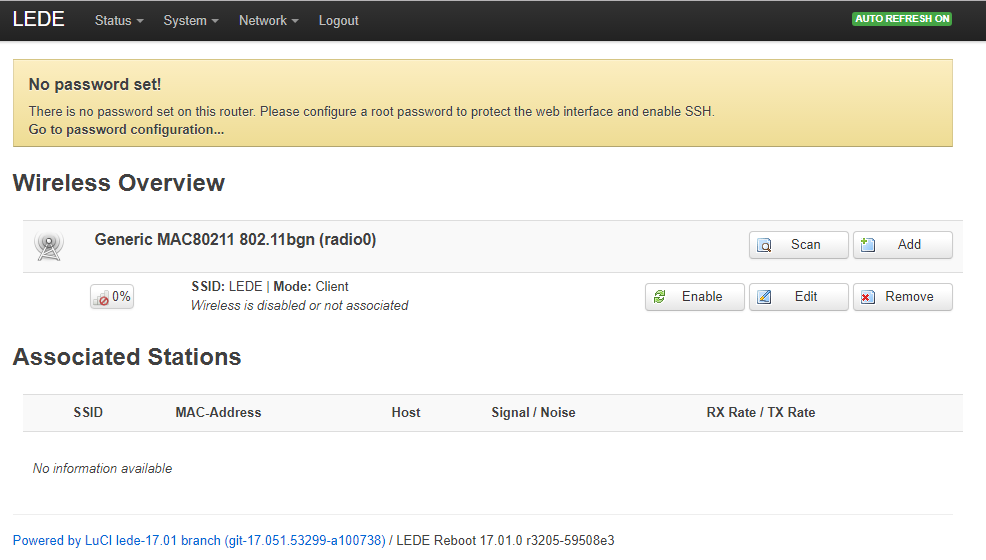
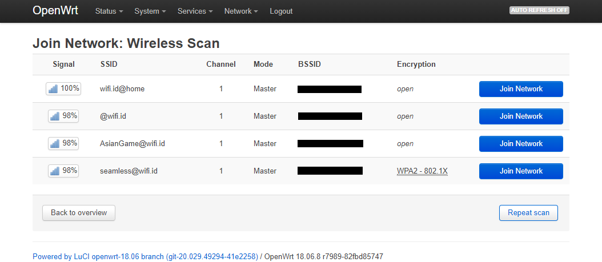
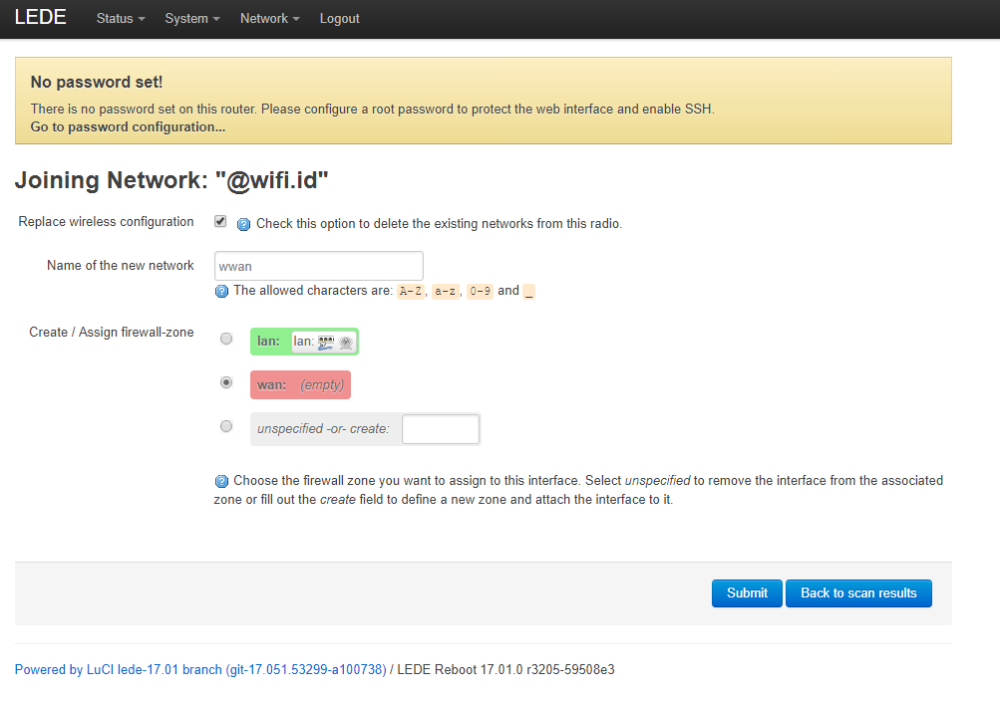
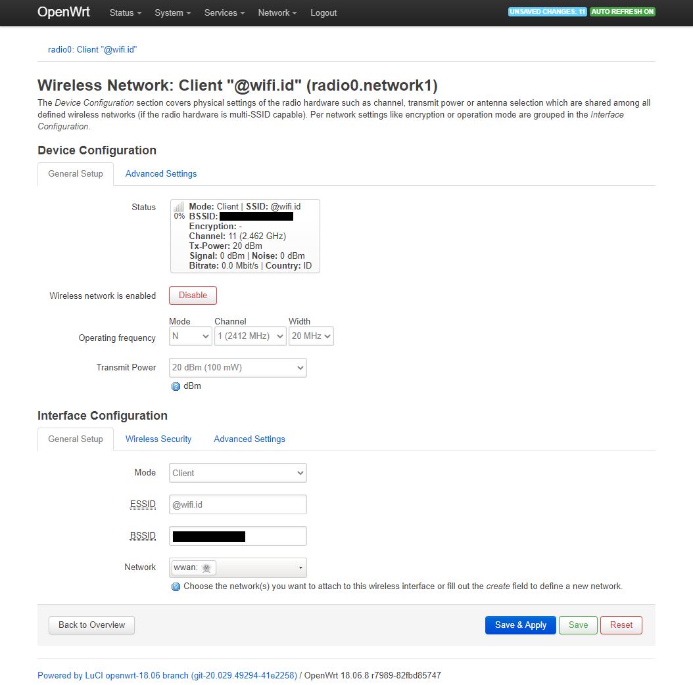
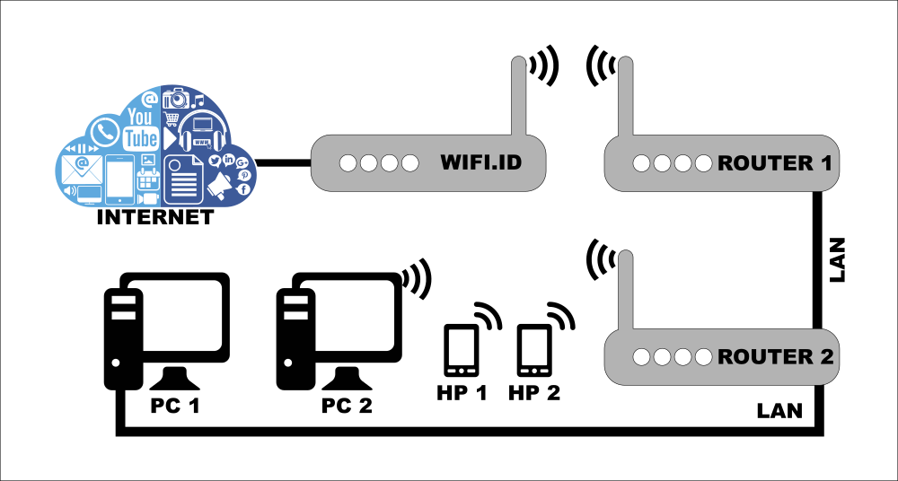

### **Tutorial Untuk Memancarkan Kembali Sinyal @wifi.id Menggunakan OpenWrt/LEDE**

Di sini saya akan membeberkan cara memancarkan kembali sinyal @wifi.id untuk dipakai bersama-sama (misalnya saya untuk berlangganan internet di rumah).

### **Persyaratan:**

1. Terjangkau jaringan @wifi.id (nama wifi/SSID: @wifi.id, indischool@wifi.id, wifi.id@home, dan seamless@wifi.id)

2. Punya router jaringan berbasiskan OpenWrt/LEDE (misalnya yang murah: [ini](http://www.jakartanotebook.com/movistar-asl-26555-openwrt-adsl-network-storage-3g-wireless-router-wifi-hotspot-white) dan [itu](http://www.jakartanotebook.com/gl.inet-openwrt-mini-smart-router-16mb-rom-6416a-white), daftar perangkat lain selengkapnya bisa lihat [di sini](http://wiki.openwrt.org/toh/start)), proses pemasangan firmware berbeda antara 1 perangkat dan lainnya, jadi tidak saya bahas di sini. Paket tambahan yang dibutuhkan hanya **luci** (dan **wpad** jika seamless@wifi.id), untuk memudahkan konfigurasi.

3. Punya akun @wifi.id (beli voucher fisik, atau lewat SMS ke 98108, lewat aplikasi wifi.id GO ([android](https://play.google.com/store/apps/details?id=com.telkom.wifiidgo), [iOS](https://apps.apple.com/id/app/wifi-id-go/id1198078195)) atau lewat online marketplace seperti [Tokopedia](https://www.tokopedia.com/streaming/))

### **Cara mengetahui apakah jaringan @wifi.id bisa dipakai atau tidak**
Untuk mengecek ketersediaan pemancar @wifi.id di daerah sekitar, bisa mengecek di fitur "Hotspot Finder" yang tersedia di aplikasi wifi.id GO ([android](https://play.google.com/store/apps/details?id=com.telkom.wifiidgo), [iOS](https://apps.apple.com/id/app/wifi-id-go/id1198078195)), atau melalui situs resmi @wifi.id: https://wifi.id/cari-wifi

Berhubung tidak semua pemancar @wifi.id bisa digunakan, silahkan dicoba dulu untuk login menggunakan handphone atau laptop sebelum melanjutkan.

### **Langkah-Langkah**
#### **A. Mengatur DNS router**
1. Koneksikan perangkat (PC/laptop) ke router (biasanya [192.168.1.1](http://192.168.1.1))

   

2. Masuk ke tab **Network** -> **Interfaces**

3. Tekan tombol **Edit** di bagian **LAN**

   

4. Scroll ke bagian **DHCP Server** di bawah, lalu tekan tab **Advanced Settings*

5. Masukkan `6,118.98.44.10,118.98.44.100` di bagian **DHCP-Options**

   

6. Tekan tombol **Save and Apply**

7. Cabut-pasang kembali kabel LAN agar pengaturan ini langsung dipakai oleh perangkat

#### **B Koneksi dengan jaringan @wifi.id (selain seamless@wifi.id)**

1. Buka tab **Network** -> **Wifi/Wireless**

   

2. Tekan tombol **Scan**

3. Pilih jaringan @wifi.id (jangan pilih yang flashzone-seamless ataupun seamless@wifi.id, yang bisa hanya @wifi.id, indischool@wifi.id, dan@wifi.id@home) dengan menekan tombol **Join Network** di sisi kanan nama jaringan.

   

4. Biarkan pengaturan bawaan dari OpenWrt/LEDE, langsung tekan **Submit**

   

5. Anda akan dibawa ke pengaturan wifi, tidak perlu ganti apapun, langsung tekan **Save and Apply**

   

6. Anda akan dibawa kembali ke halaman awal, status koneksi harusnya sudah berwarna biru yang menandakan berhasil terkoneksi ke jaringan

   

7. Halaman login akan muncul, lakukan login sesuai dengan voucher yang sudah dibeli

   

#### **C. Memancarkan kembali sinyal @wifi.id**

Untuk memancarkan kembali sinyal @wifi.id, saya menyarankan untuk menggunakan perangkat/router kedua, agar bandwidth tidak terpotong 50% dan lebih stabil dalam penggunaannya, seperti gambar berikut:

   

Jika ada keterbatasan dana yang menghalangi penggunaan 2 perangkat router (1 untuk menangkap dan 1 untuk menyebarkan kembali), sebenarnya anda bisa saja menggunakan 1 perangkat untuk kedua tugas tersebut, hanya saja kecepatan jaringan akan berkurang sebesar 50%. Langkah-langkahnya bisa dibaca di dokumen [repeater-mode.md](repeater-mode.md)

### seamless@wifi.id

Karena adanya tambahan langkah-langkah agar terkoneksi ke sinyal seamless@wifi.id, maka saya pisahkan ke dokumen [seamless.md](seamless.md)