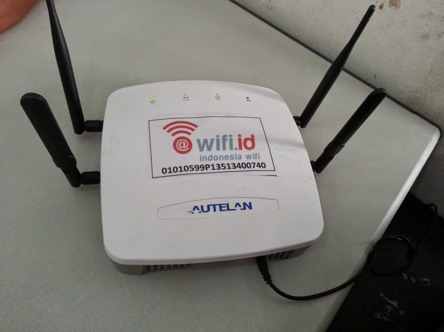
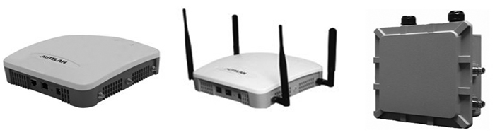
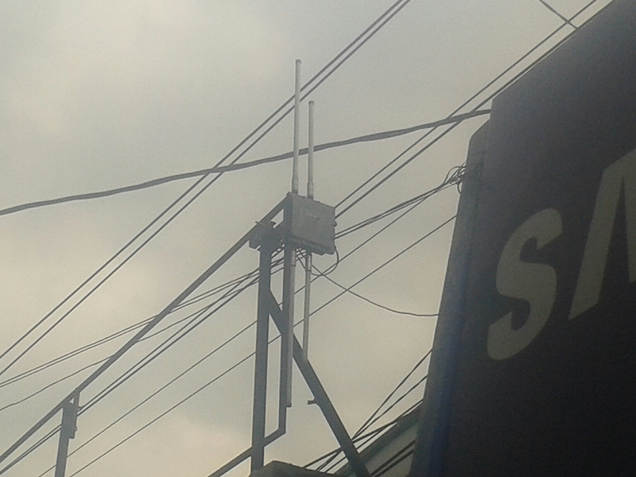
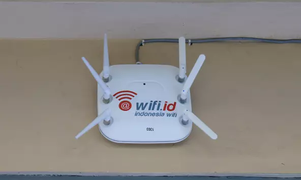
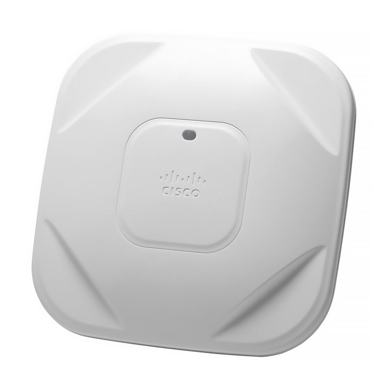
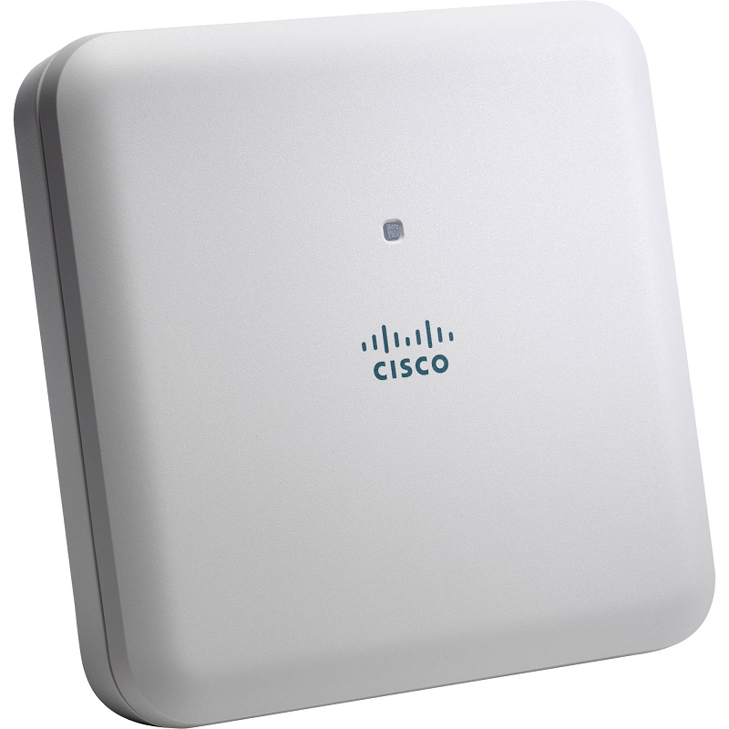
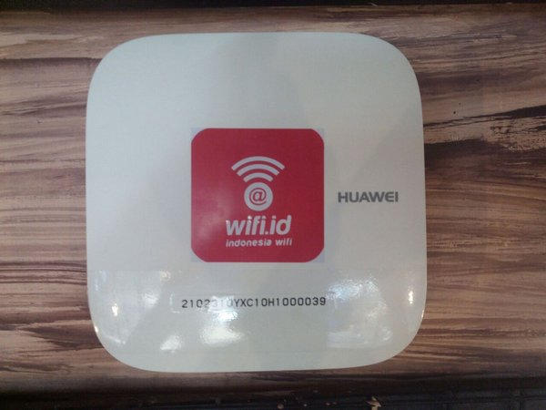

### **Ciri-ciri Pemancar sinyal @wifi.id yang Bisa Dipakai**

Mudahnya, hampir semua pemancar sinyal @wifi.id yang bisa dipakai ada stiker logo @wifi.id, tapi ada saja beberapa pemancar yang tidak ada stikernya, entah memang dari awalnya tidak terpasang atau memang dilepas. Berikut adalah beberapa merk dan tipe yang bisa dijumpai di lapangan:

1. Autelan

Merk ini setahu saya merupakan salah satu merk yang paling lama ada dan banyak tersebar di tempat-tempat umum, seperti alun-alun, plasa telkom, sekolah negeri, puskesmas, dll.

Pemancar dari merk ini ada 3 tipe: indoor tanpa antena, indoor dengan antena dan outdoor.
Bentuk fisiknya bisa dilihat di gambar berikut:

Untuk yang tipe outdoor, terdapat 4 antena panjang ketika terpasang di lapangan, seperti berikut:

2. Cisco

Merk ini setahu saya biasanya dipakai sebagai pengganti Autelan atau untuk keperluan WMS. Setidaknya ada 3 tipe:

  
  

3. Huawei

Penulis belum mendapatkan informasi lebih lanjut soal merk ini, mungkin dipakai untuk keperluan WMS di beberapa daerah.

  

	<b>Kirim dukungan donasi melalui:</b>

    <a href="https://trakteer.id/kopijahe">

