### **Tutorial Login Otomatis di Jaringan Venue WMS**

Kesal harus bolak-balik login ketika memakai jaringan Venue WMS di rumah?

### **Persyaratan:**

1. Wajib menggunakan router berbasis openwrt

> :loudspeaker: Jika menggunakan router lain, penulis tidak menjamin bisa dipakai, tapi mungkin saja secara garis besar sama.

2. Menggunakan Google Chrome

3. PuTTY (unduh dan pasang [dari situs ini](https://www.chiark.greenend.org.uk/~sgtatham/putty/latest.html))

### **Langkah-Langkah**

> :warning: Jika digunakan untuk autologin SSID venue WMS, maka bisa mengikuti langkah-langkah di dokumen [autologin-wms.md](autologin-wms.md)

#### **A. Mengatur hostnames**
1. Koneksikan perangkat (PC/laptop) ke router (biasanya [192.168.1.1](http://192.168.1.1))

   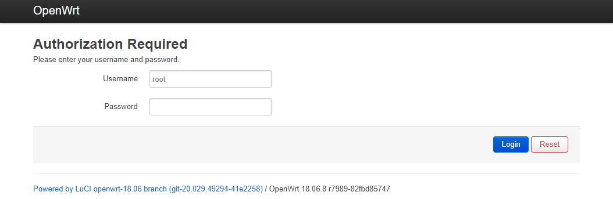

2. Masuk ke tab **Network** -> **Hostnames**

   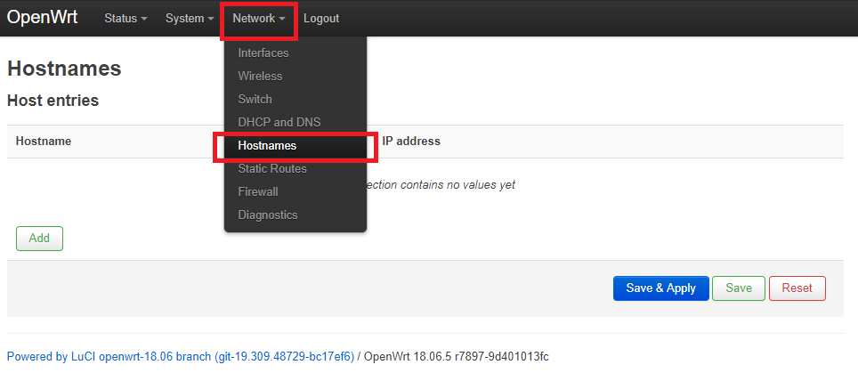

3. Tekan tombol **Add**

   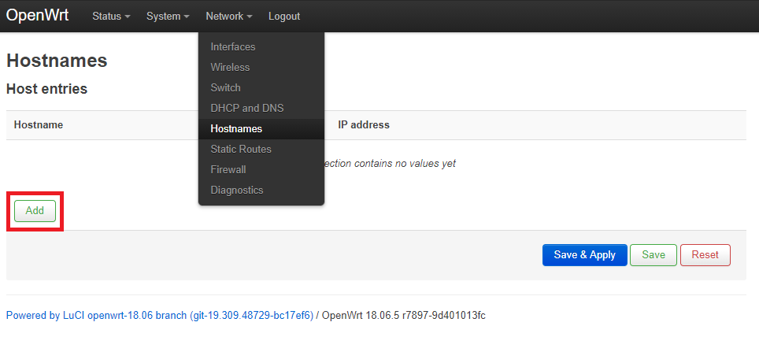

4. Masukkan ```welcome2.wifi.id``` di bagian **hostname**

5. Di bagian IP, pilih **custom**, lalu masukkan ```10.233.16.32``` (atau kalau tidak bisa: ```10.233.16.13```)

   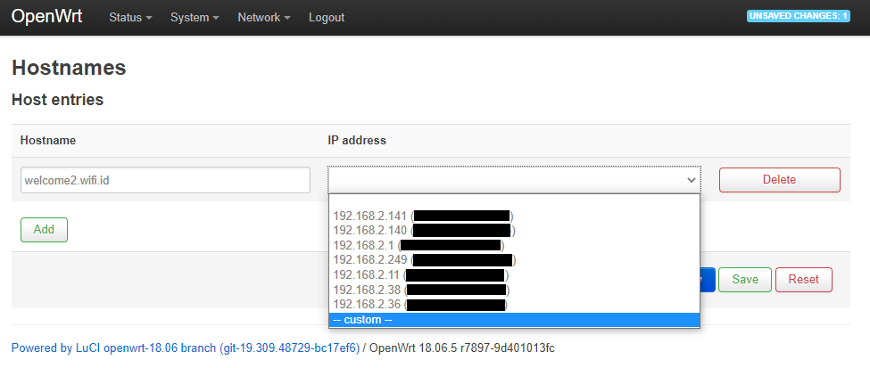

6. Ulangi untuk hostname ```lp.wifi.id``` dengan IP ```36.86.63.19``` (atau kalau tidak bisa: ```36.91.226.203```)

7. Tekan tombol **Save & Apply**

   

#### **B. Script autologin**
1. Pastikan sudah terkoneksi ke jaringan @wifi.id **dan belum login**

2. Buka halaman login menggunakan Google Chrome

3. Di halaman login, tekan tombol ```F12```, lalu buka tab **Network** di bagian samping kanan dan centang **Preserve log**

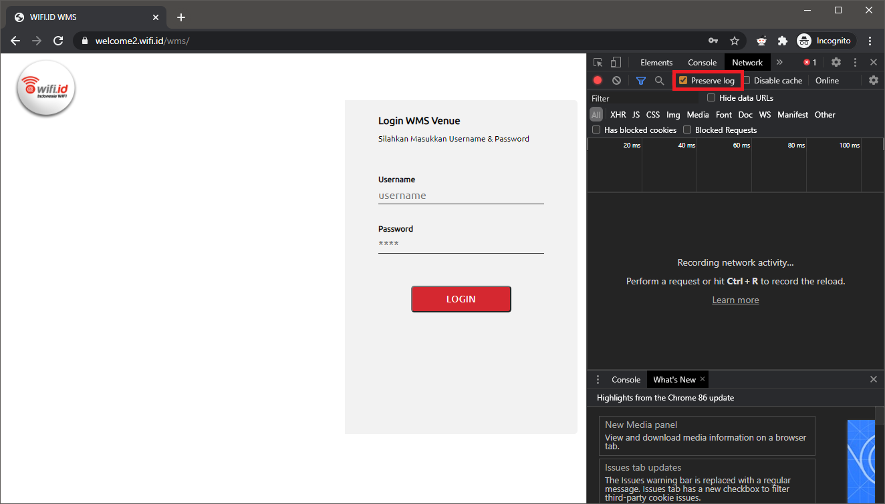

4. Lakukan login seperti biasa

5. Setelah login, di bagian kanan tadi carilah item berawalan **quarantine.php** dengan scroll ke atas

6. Klik kanan **quarantine.php**, lalu pilih **Copy** -> **Copy as cURL (bash)**

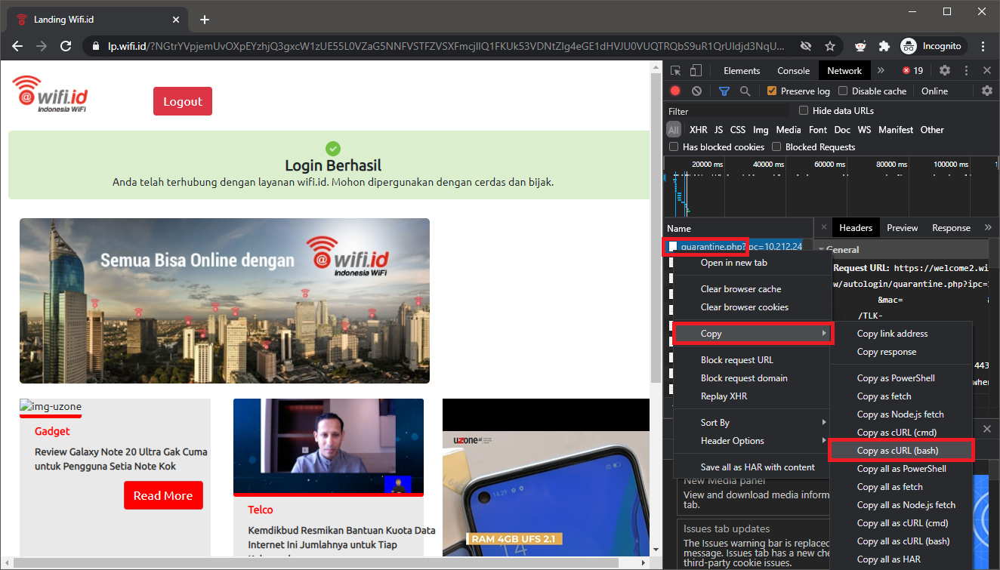

7. Buka PuTTY, mulai koneksi **SSH** ke router (biasanya ```192.168.1.1```)

8. Ketikkan: ```opkg update && opkg install curl```

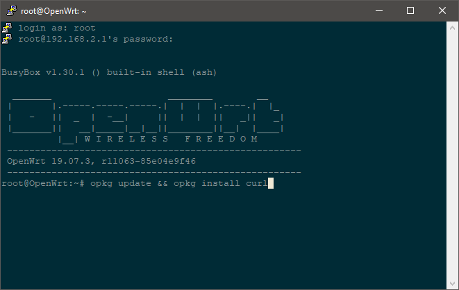

9. Ketikkan: ```vi /etc/login_file.txt```

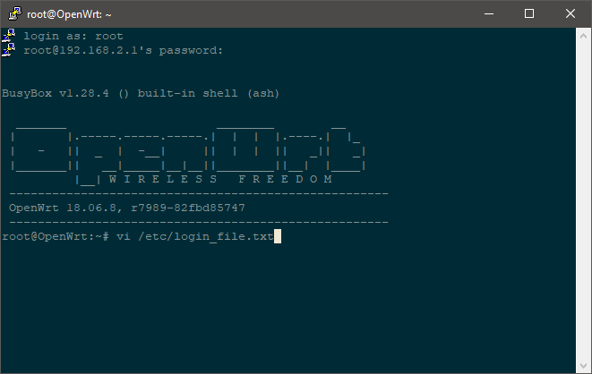

10. Sebelum paste hasil dari no. 6, tekan huruf ```i``` terlebih dahulu, perhatikan status di bagian pojok kiri bawah:

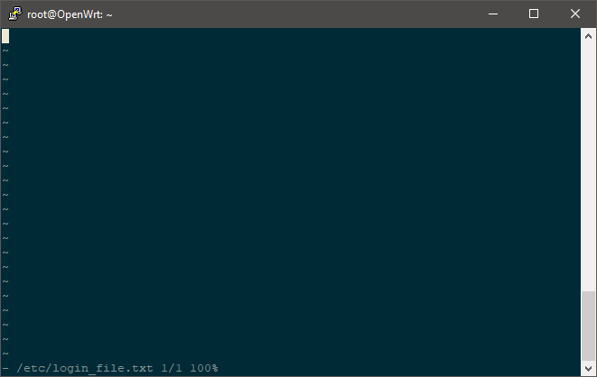

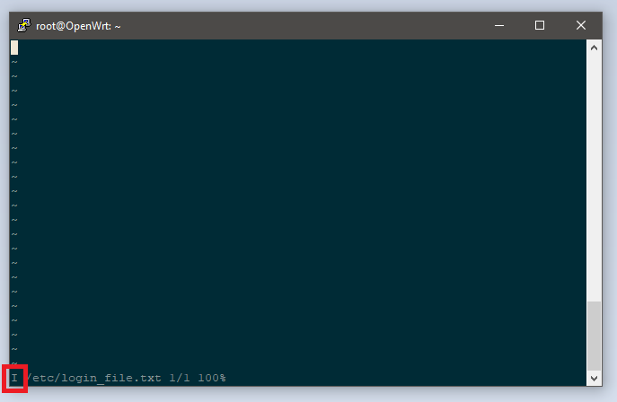

11. Paste hasil dari no. 6 dengan menekan tombol kanan mouse

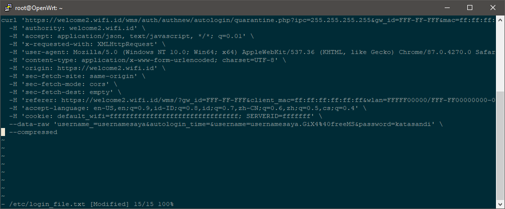

12. Hapus baris yang berisikan ```--compressed```

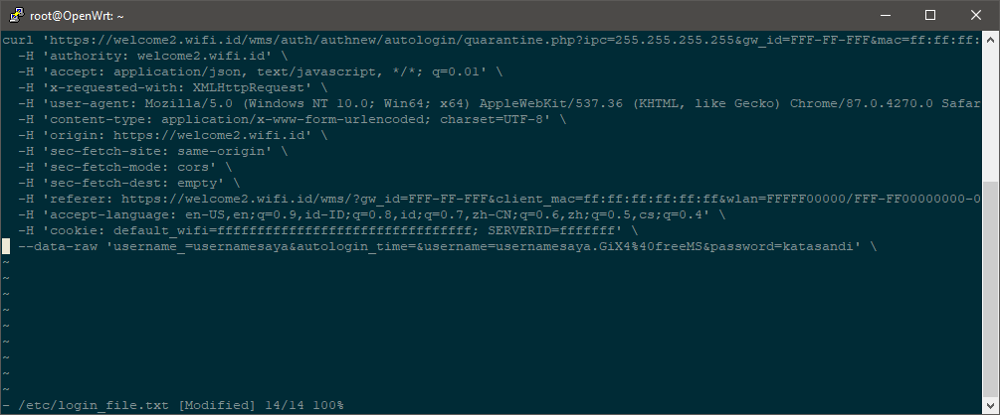

13. Hapus akhiran ` \`

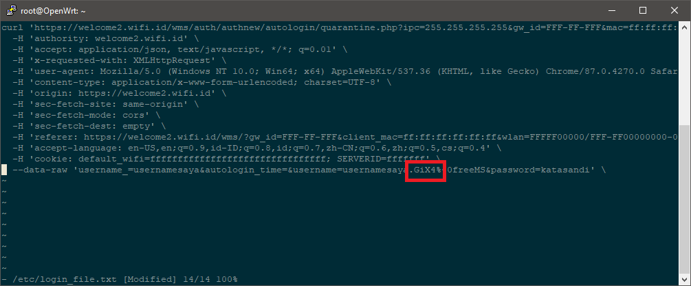
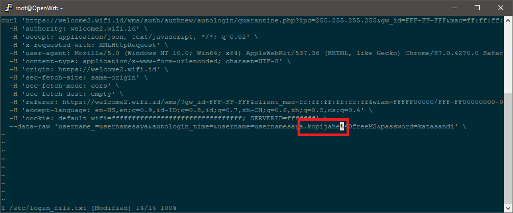

 > :warning: Jika tidak dihapus, akan mengalami error ini: `/etc/autologin.sh: eval: line 1: syntax error: unterminated quote string`

14. Ganti 4 karakter di bagian sebelum `%40freeMS` dengan `$randomid`

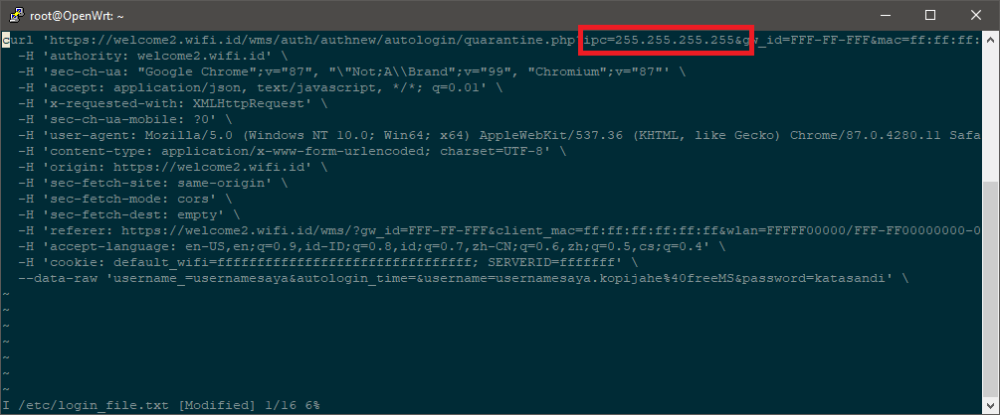
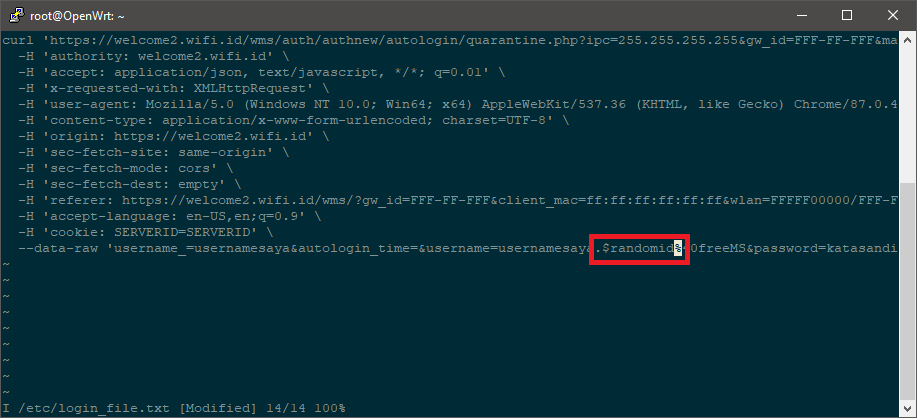


15. Tekan tombol ```ESC``` lalu ketikkan ```:wq``` untuk menyimpan perubahan berkas

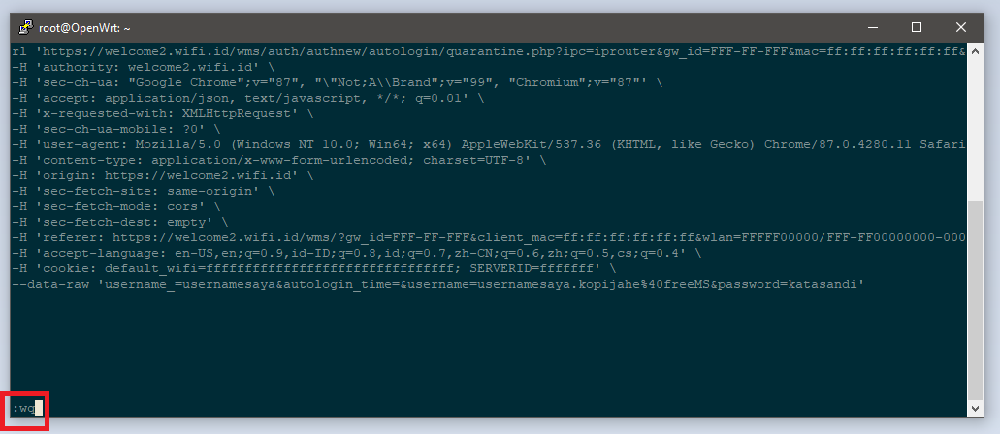

16. Atur supaya berkas ```login_file.txt``` bisa dijalankan dengan mengetikkan ```chmod +x /etc/login_file.txt```

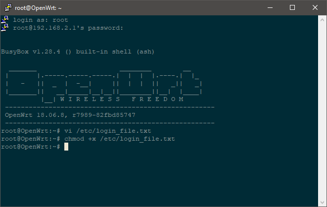

16. Unduh script autologin dengan menggunakan perintah: ```curl https://raw.githubusercontent.com/kopijahe/wifiid-openwrt/master/scripts/autologin-wms.sh -o /etc/autologin.sh```

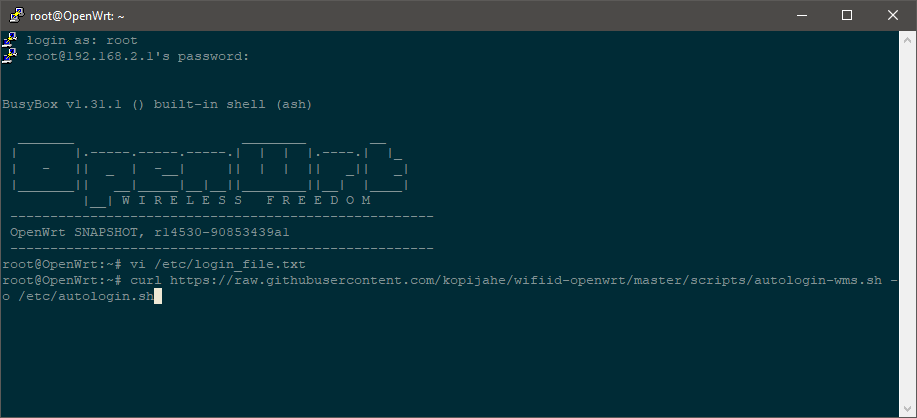

> :pushpin: Jika terdapat gangguan (misal: script mengulang-ulang login padahal sudah login) di berkas [autologin-wms.sh](scripts/autologin.sh), bisa dicoba menggunakan berkas alternatif:
> 1. [autologin-wms-firefox.sh](scripts/autologin-wms-firefox.sh), dengan perintah: ```curl https://raw.githubusercontent.com/kopijahe/wifiid-openwrt/master/scripts/autologin-wms-firefox.sh -o /etc/autologin.sh```
> 2. [autologin-wms-google.sh](scripts/autologin-wms-google.sh), dengan perintah: ```curl https://raw.githubusercontent.com/kopijahe/wifiid-openwrt/master/scripts/autologin-wms-google.sh -o /etc/autologin.sh```
>
> :warning: Jika menggunakan berkas script alternatif, **tidak perlu** disesuaikan namanya di langkah-langkah berikutnya.
>
> :loudspeaker: Gagal ketika mengunduh script? Lihat solusinya [di sini](https://github.com/kopijahe/wifiid-openwrt/issues/3).

17. Atur supaya berkas ```autologin.sh``` bisa dijalankan dengan mengetikkan ```chmod +x /etc/autologin.sh```

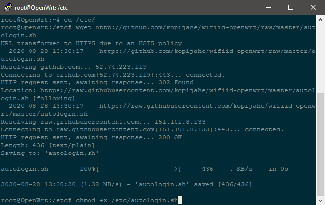

18. Buka berkas ```/etc/rc.local``` dengan mengetikkan ```vi /etc/rc.local```

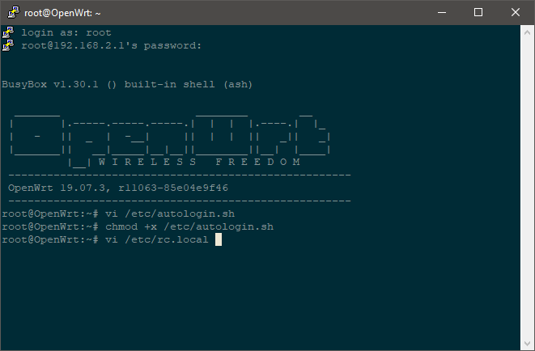

19. Tekan huruf ```i```, lalu tambahkan baris ```/bin/sh /etc/autologin.sh &``` di atas baris ```exit 0```

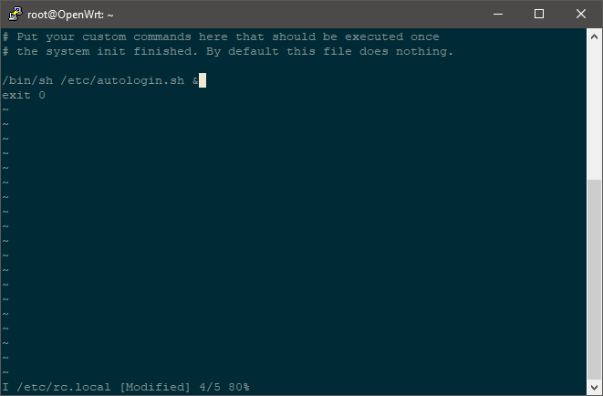

20. Tekan tombol ```ESC``` lalu ketikkan ```:wq``` untuk menyimpan perubahan berkas

21. Ketikkan ```sh /etc/rc.local``` untuk menjalankan script yang sudah kita racik, jika muncul tulisan ```Sudah terkoneksi ke Internet``` maka **anda sudah berhasil**.

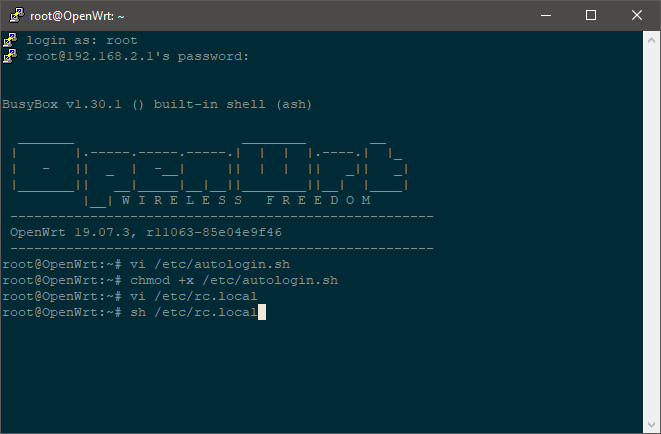

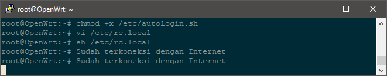

> Untuk kedepannya, jika username/password yang digunakan sudah diganti/tidak berlaku, atau proses autologin sudah tidak lagi berjalan, maka hanya perlu mengulangi langkah nomor 9 sampai 16 saja.

<br><br>
> :loudspeaker: **Masih ada pertanyaan lain?** Bisa merujuk ke dokumen [faq-technical-info.md](faq-technical-info.md)