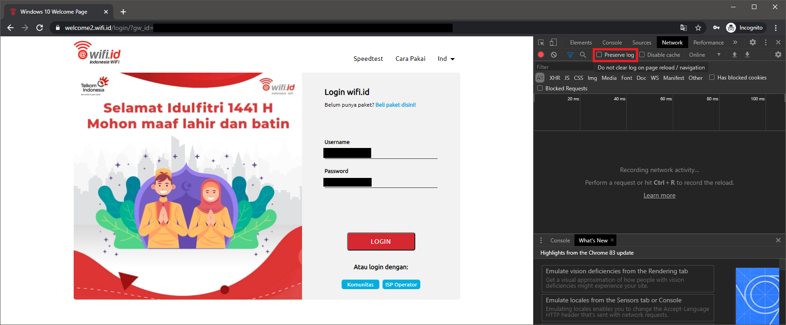

### **Tutorial Login Otomatis di Jaringan @wifi.id**

Kesal harus bolak-balik login ketika memakai jaringan @wifi.id di rumah?

Solusinya ada 2:

1. Pakai jaringan seamless@wifi.id (tidak semua pemancar yang bisa dipakai ada dan bisa sampai login)
2. Pakai router berbasis openwrt dan script untuk login secara otomatis jika jaringan internet terdeteksi tidak tersambung

### **Persyaratan:**

1. Wajib menggunakan router berbasis openwrt

> :loudspeaker: Jika menggunakan router lain, penulis tidak menjamin bisa dipakai, tapi mungkin saja secara garis besar sama.

2. Menggunakan Google Chrome

3. PuTTY (unduh dan pasang [dari situs ini](https://www.chiark.greenend.org.uk/~sgtatham/putty/latest.html))

### **Langkah-Langkah**
#### **A. Mengatur hostnames**
1. Koneksikan perangkat (PC/laptop) ke router (biasanya [192.168.1.1](http://192.168.1.1))

   

2. Masuk ke tab **Network** -> **Hostnames**

   

3. Tekan tombol **Add**

   

4. Masukkan ```welcome2.wifi.id``` di bagian **hostname**

5. Di bagian IP, pilih **custom**, lalu masukkan ```10.233.16.32``` (atau kalau tidak bisa: ```10.233.16.13```)

   

6. Ulangi untuk hostname ```lp.wifi.id``` dengan IP ```36.86.63.19``` (atau kalau tidak bisa: ```36.91.226.203```)

7. Tekan tombol **Save & Apply**

   

#### **B. Script autologin**
1. Pastikan sudah terkoneksi ke jaringan @wifi.id **dan belum login**

2. Buka halaman login menggunakan Google Chrome

3. Di halaman login, tekan tombol ```F12```, lalu buka tab **Network** di bagian samping kanan dan centang **Preserve log**



4. Lakukan login seperti biasa

5. Setelah login, di bagian kanan tadi carilah item berawalan **check-login.php** dengan scroll ke atas

6. Klik kanan **check-login.php**, lalu pilih **Copy** -> **Copy as cURL (bash)**


7. Paste hasilnya ke notepad, hapus baris yang berisikan ```--compressed```


8. Jadikan hasilnya ke 1 baris saja seperti ini:


9. Tekan tombol ```Ctrl + H```, lalu ganti semua tanda kutip 1 menjadi tanda kutip 2


10. Buka berkas [autologin.sh](autologin.sh), lalu salin isinya ke berkas baru di notepad

11. Paste hasil dari no. 9 di atas ke bagian ```curl <paste output curl>``` seperti contoh berikut:


12. Buka PuTTY, mulai koneksi **SSH** ke router (biasanya ```192.168.1.1```)

13. Ketikkan: ```opkg update && opkg install curl```


14. Ketikkan: ```vi /etc/autologin.sh```


15. Sebelum paste hasil dari no. 11, tekan huruf ```i``` terlebih dahulu, perhatikan status di bagian pojok kiri bawah:


16. Paste hasil dari no. 11 dengan menekan tombol kanan mouse

17. Tekan tombol ```ESC``` lalu ketikkan ```:wq``` untuk menyimpan perubahan berkas


18. Atur supaya berkas ```autologin.sh``` bisa dijalankan dengan mengetikkan ```chmod +x /etc/autologin.sh```


19. Buka berkas ```/etc/rc.local``` dengan mengetikkan ```vi /etc/rc.local```


20. Tekan huruf ```i```, lalu tambahkan baris ```/bin/sh /etc/autologin.sh &``` di atas baris ```exit 0```


21. Tekan tombol ```ESC``` lalu ketikkan ```:wq``` untuk menyimpan perubahan berkas

22. Ketikkan ```sh /etc/rc.local``` untuk menjalankan script yang sudah kita racik, jika muncul tulisan ```Connected to the internet``` maka **anda sudah berhasil**.


