### **Tutorial Login Otomatis di Jaringan @wifi.id**

Kesal harus bolak-balik login ketika memakai jaringan @wifi.id di rumah?

Solusinya ada 2:

1. Pakai jaringan seamless@wifi.id (tidak semua pemancar yang bisa dipakai ada dan bisa sampai login)
2. Pakai router berbasis openwrt dan script untuk login secara otomatis jika jaringan internet terdeteksi tidak tersambung

### **Persyaratan:**

1. Wajib menggunakan router berbasis openwrt

> :loudspeaker: Jika menggunakan router lain, penulis tidak menjamin bisa dipakai, tapi mungkin saja secara garis besar sama.

2. Menggunakan Google Chrome

3. PuTTY (unduh dan pasang [dari situs ini](https://www.chiark.greenend.org.uk/~sgtatham/putty/latest.html))

### **Langkah-Langkah**

1. Pastikan sudah terkoneksi ke jaringan @wifi.id **dan belum login**

2. Buka halaman login menggunakan Google Chrome

3. Di halaman login, tekan tombol ```F12```, lalu buka tab **Network** di bagian samping kanan dan centang **Preserve log**


4. Lakukan login seperti biasa

5. Setelah login, di bagian kanan tadi carilah item berawalan **check-login.php** dengan scroll ke atas

6. Klik kanan **check-login.php**, lalu pilih **Copy** -> **Copy as cURL (bash)**

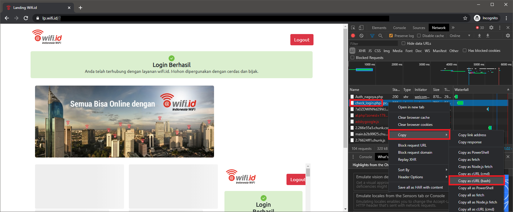

7. Paste hasilnya ke notepad, hapus baris yang berisikan ```--compressed```

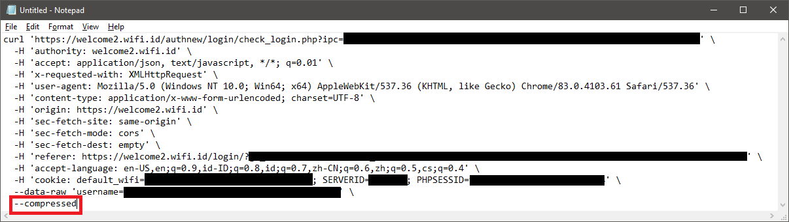

8. Jadikan hasilnya ke 1 baris saja seperti ini:

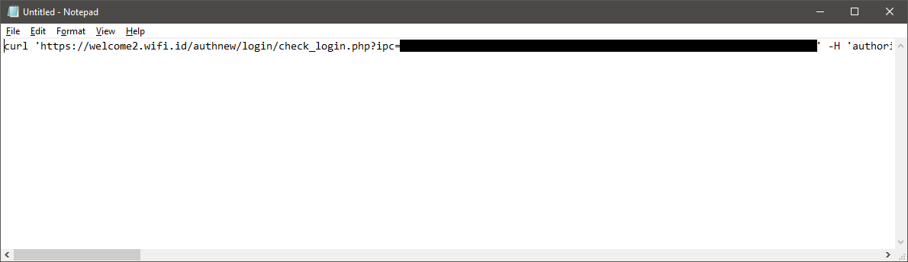

9. Tekan tombol ```Ctrl + H```, lalu ganti semua tanda kutip 1 menjadi tanda kutip 2


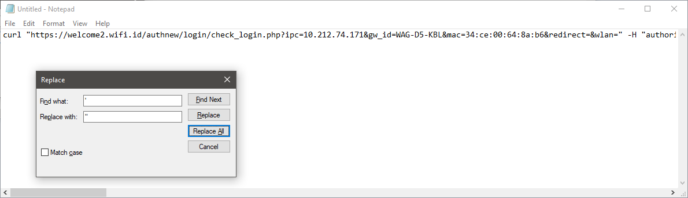

10. Buka berkas [autologin.sh](autologin.sh), lalu salin isinya ke berkas baru di notepad

11. Paste hasil dari no. 9 di atas ke bagian ```curl <paste output curl>``` seperti contoh berikut:

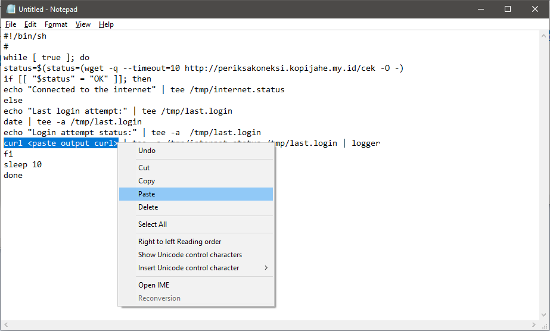

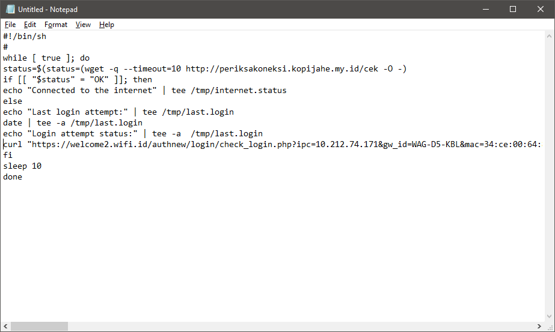

12. Buka PuTTY, mulai koneksi **SSH** ke router (biasanya ```192.168.1.1```)

13. Ketikkan: ```vi /etc/autologin.sh```

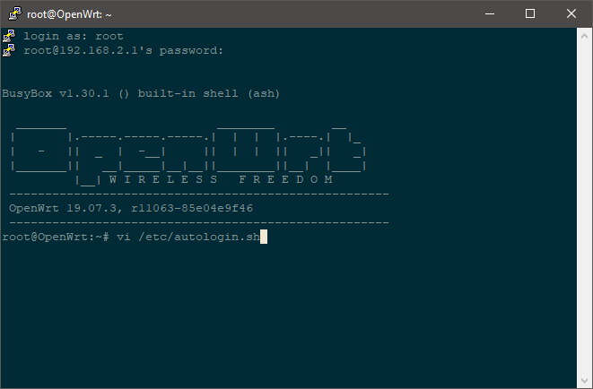

14. Sebelum paste hasil dari no. 11, tekan huruf ```i``` terlebih dahulu, perhatikan status di bagian pojok kiri bawah:

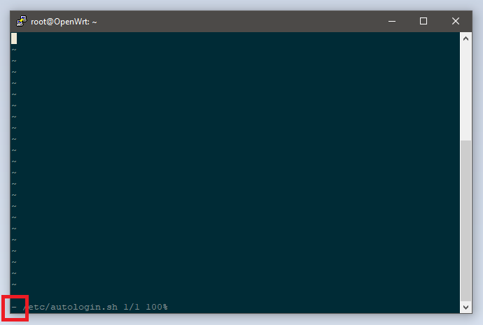

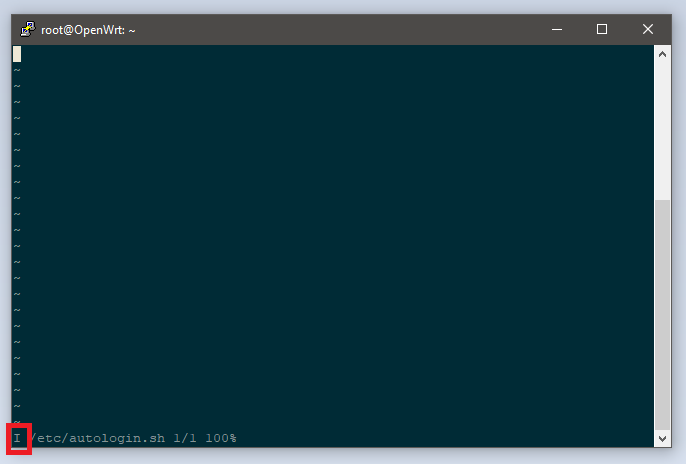

15. Paste hasil dari no. 11 dengan menekan tombol kanan mouse

16. Tekan tombol ```ESC``` lalu ketikkan ```:wq``` untuk menyimpan perubahan berkas

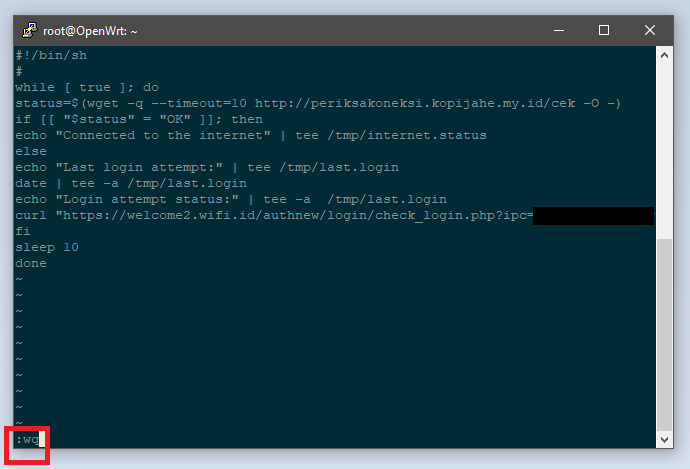

17. Atur supaya berkas ```autologin.sh``` bisa dijalankan dengan mengetikkan ```chmod +x /etc/autologin.sh```

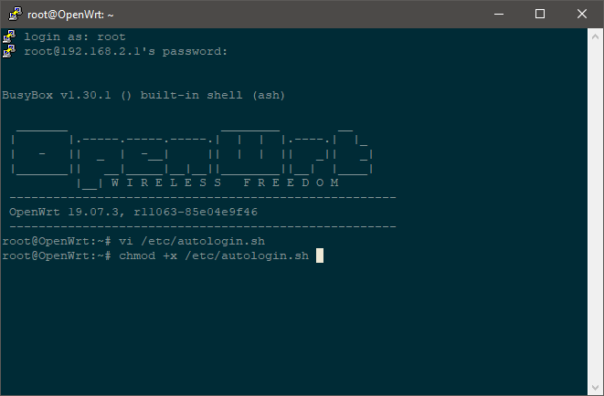

18. Buka berkas ```/etc/rc.local``` dengan mengetikkan ```vi /etc/rc.local```


19. Tekan huruf ```i```, lalu tambahkan baris ```/bin/sh /etc/autologin.sh &``` di atas baris ```exit 0```


20. Tekan tombol ```ESC``` lalu ketikkan ```:wq``` untuk menyimpan perubahan berkas

21. Ketikkan ```sh /etc/rc.local``` untuk menjalankan script yang sudah kita racik, jika muncul tulisan ```Connected to the internet``` maka **anda sudah berhasil**.


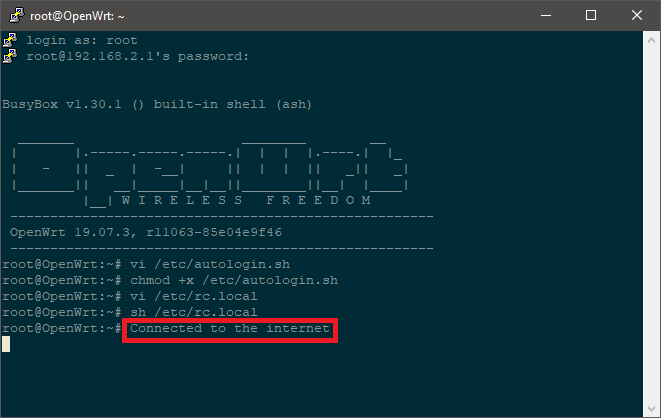