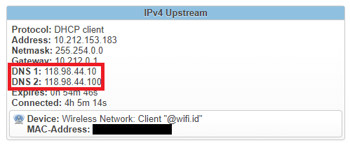
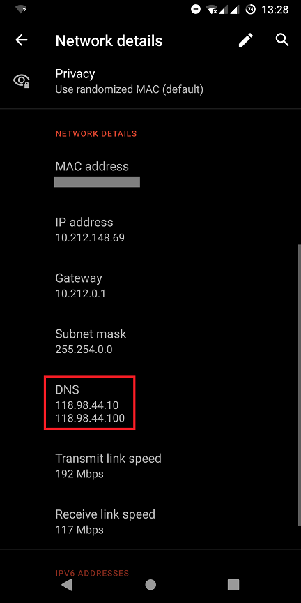
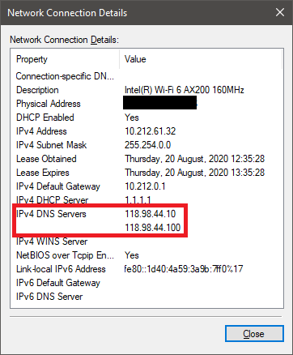
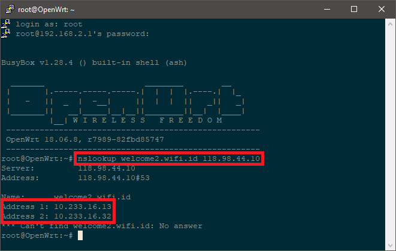
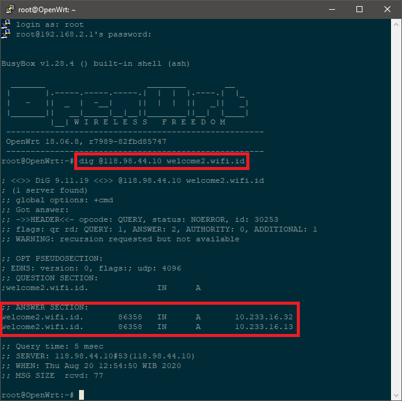
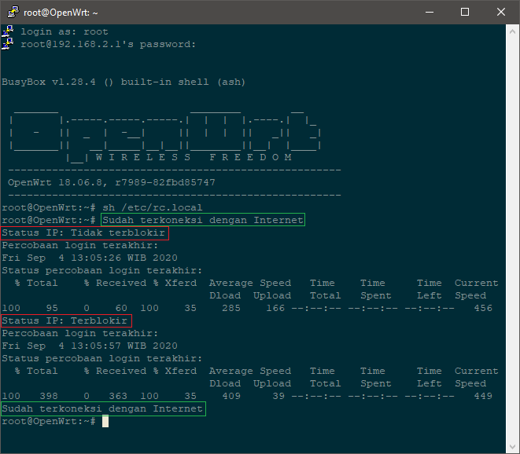

### **Pertanyaan yang sering diajukan dan Dokumen Teknis**

> :loudspeaker: Punya pertanyaan lain? Silahkan buat akun github dan bertanya di [tab Issues](https://github.com/kopijahe/wifiid-openwrt/issues) dengan menekan tombol hijau `New Issue`.

### **DNS Jaringan @wifi.id**

:question: _DNS `118.98.44.10` dan `118.98.44.100` dapatnya dari mana? Karena di daerah saya, DNS tersebut tidak bisa dipakai..._

:bulb: Bisa dilihat dari sewaktu survey menggunakan handphone/laptop, ataupun dari informasi yang diberikan oleh openwrt, bisa dilihat di halaman status koneksi. Contohnya bisa dilihat di gambar-gambar berikut:

   openwrt:  
   

   android:  
   

   windows:  
   

Kalau misal di daerah anda ternyata menggunakan alamat server DNS yang berbeda, bisa disesuaikan dengan kondisi di daerah masing-masing.

<br><br>

:question:  _Bagaimana cara tahu alamat IP untuk domain-domain yang diperlukan untuk hostname autologin?_

:bulb: Bisa menggunakan perintah `nslookup <nama domain> <server DNS>`, baik di openwrt ataupun di perangkat lainnya yang terhubung ke jaringan, dan dikonfirmasi setelah dicoba tambahkan sebagai hostname di openwrt.

   
	
Bila perintahnya tidak menghasilkan IP yang sesuai (misal tetap tidak bisa login), maka disarankan untuk memasang paket `bind-dig` dengan perintah: `opkg update && opkg install bind-dig`. Setelah terpasang, lakukan perintah: `dig @<server DNS> <nama domain>`

   

### **Autologin**

:question: _Pas awal pakai script, bisa jalan sih, berhari-hari juga tidak ada masalah. Tapi begitu padam listrik, atau router saya reboot, script tidak jalan lagi, gimana?_

:bulb: Silahkan mengecek [pemecahan masalahnya di sini](https://github.com/kopijahe/wifiid-openwrt/issues/4).

<br><br>

:question: _Saya lihat di script itu ada jeda pengecekan setiap 10 detik, kenapa tidak dibikin lebih pendek, misalnya 1 detik saja? Supaya kalau terputus pas lagi main game ga nunggu lama-lama..._

:bulb: Biasanya kalau terlalu cepat dalam autologin, akan mendapat status \[Ban IP\] atau \[IP Blocked\] yang menyebabkan gagalnya autologin dan juga kemungkinan turunnya kecepatan internet.

<br><br>

:question: _Saya lihat di script, untuk periksa koneksinya ke domain `periksakoneksi.kopijahe.my.id`, apa aman? Kenapa tidak mengecek ke tempat lain saja?_

:bulb: Aman-aman saja, karena tujuannya hanya mengunduh berkas [cek](https://github.com/kopijahe/periksakoneksi.kopijahe.my.id/blob/master/cek) lalu melihat apakah isinya benar "OK". Saya tidak mendapatkan/mengambil data apapun dari perangkat anda.

Jika masih ragu, bisa menggunakan script alternatif:

> 1. [autologin-firefox.sh](scripts/autologin-firefox.sh), script ini menggunakan sistem yang sama dengan script [autologin.sh](scripts/autologin.sh), hanya saja domainnya milik mozilla/firefox.
> 2. [autologin-google.sh](scripts/autologin-google.sh), script ini mengecek ke domain yang sama dengan yang digunakan perangkat android untuk mengecek status koneksi internet.

Penjelasan lebih lanjut mengenai cara kerja script, bisa merujuk ke dokumen [ini](scripts/README.md).

<br><br>

:question: _Bisakah autologin dipakai untuk 2 koneksi berbeda? Router saya bisa 2 frekuensi (2,4 GHz dan 5,8 Ghz), rencananya saya pakai 2 akun dan di loadbalance (misal pakai mwan di openwrt)..._

:bulb: Bisa saja:

 > 1. Buat berkas autologin kedua dengan perintah ```cp /etc/autologin.sh /etc/autologin2.sh```
 > 2. Buka berkas autologin2.sh dengan perintah ```vi /etc/autologin2.sh```
 > 3. Tekan huruf ```i``` untuk memulai edit berkas autologin2.sh
 > 4. Ganti isi variabel loginwifi dengan nama berkas lain, misalnya menjadi ```loginwifi=/etc/login_file2.txt```
 > 5. Matikan dulu koneksi pertama, lalu lakukan login di koneksi kedua dan taruh hasil curl-nya di file login_file2.txt (dokumen [autologin.md](autologin.md), langkah no. 9-14)
 > 6. Edit berkas login_file.txt dengan perintah ```vi /etc/file_login.txt```, tambahkan parameter ```--interface <nama interface>``` setelah teks curl, misalnya jadi ```curl --interface wlan0 -H ....```, lalu simpan berkas
 > 7. Edit berkas login_file2.txt dengan perintah ```vi /etc/file_login2.txt```, tambahkan parameter ```--interface <nama interface>``` setelah teks curl, misalnya jadi ```curl --interface wlan1 -H ....```, lalu simpan berkas
 > 8. Tambahkan berkas autologin kedua di berkas ```/etc/rc.local```

<br><br>

:question: _Misal saya pakai kombinasi TP-Link Pharos untuk menangkap sinyal <span></span>@wifi.id + router openwrt untuk memancarkan sinyal kembali, bisakah pakai autologin di router openwrt?_

:bulb: Bisa saja. Jika nanti semisal gagal autologin, coba ditambahkan parameter ```-interface <nama interface port WAN>``` setelah perintah ```curl``` di berkas ```/etc/login_file.txt```, misalnya jadi ```curl --interface eth0.1 -H ....```

<br><br>

:question: _Bisakah jika terdeteksi IP terblokir, script otomatis meminta IP baru ke server sebelum mencoba login kembali?_

:bulb: Gunakan script seri v2:



> Lakukan sesuai langkah-langkah di dokumen [autologin.md](autologin.md), sampai bagian B, langkah no. 15 diganti:
>
> 1. [autologin-v2.sh](scripts/autologin-v2.sh), dengan perintah: ```curl https://raw.githubusercontent.com/kopijahe/wifiid-openwrt/master/scripts/autologin-v2.sh -o /etc/autologin.sh```
> 2. [autologin-firefox-v2.sh](scripts/autologin-firefox-v2.sh), dengan perintah: ```curl https://raw.githubusercontent.com/kopijahe/wifiid-openwrt/master/scripts/autologin-firefox-v2.sh -o /etc/autologin.sh```
> 3. [autologin-google-v2.sh](scripts/autologin-google-v2.sh), dengan perintah: ```curl https://raw.githubusercontent.com/kopijahe/wifiid-openwrt/master/scripts/autologin-google-v2.sh -o /etc/autologin.sh```
>
> :warning: script seri v2 tidak bisa digunakan jika perangkat autologin openwrt bukan penangkap langsung sinyal <span></span>@wifi.id (misal yang tidak bisa: Sinyal <span></span>@wifi.id ditangkap oleh TP-Link CPE210, lalu disebarkan lagi dengan Bolt 201, script autologin ada di Bolt 201).


### **Lain-lain**


:question: _Bagaimana cara meminta IP baru ke server jika IP saya terblokir? Kalau di non-OpenWrt kan ada tombolnya untuk release dan obtain IP baru..._

:bulb: Bisa lewat SSH:

> 1. Buka PuTTY, mulai koneksi **SSH** ke router (biasanya ```192.168.1.1```)
> 2. Ketikkan: ```killall -SIGUSR2 udhcpc && ifup wwan```

<br><br>

:question: _Bisa di-remote saja lewat teamviewer?_

:bulb: Untuk sementara belum bisa, silahkan diikuti kembali tutorialnya dengan detail. Bila perlu, lakukan factory reset kembali agar pengaturannya tidak tumpang-tindih.

<br><br>

:question: _Donasi?_

:bulb: 