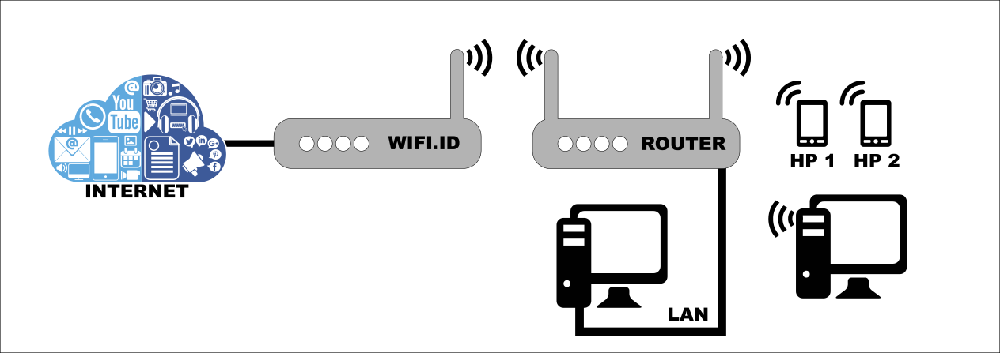
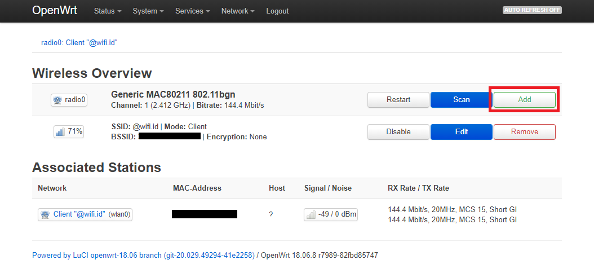
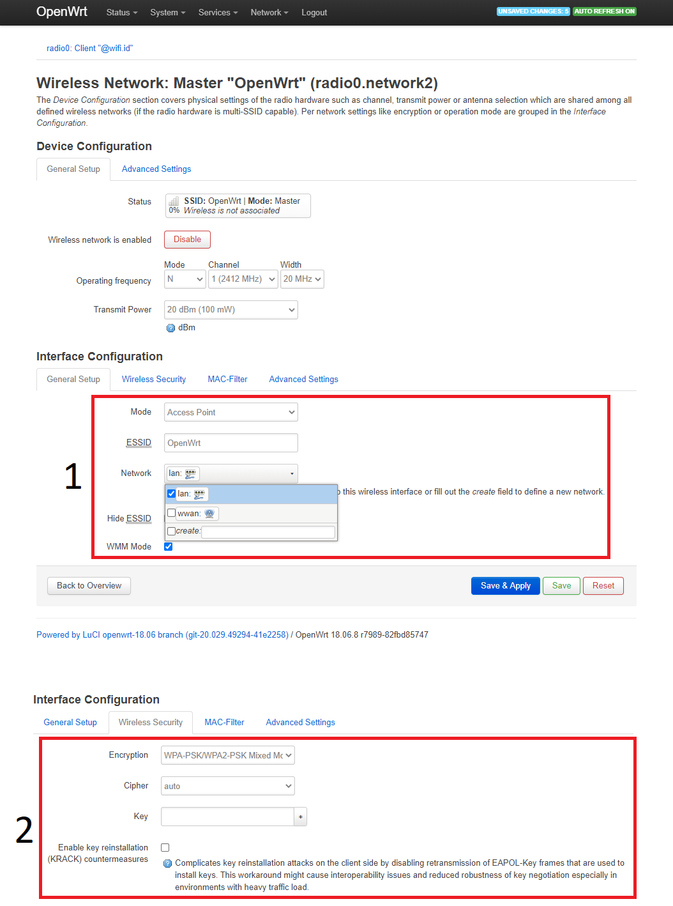

### **Tutorial Memancarkan Kembali Sinyal @wifi.id dengan 1 Perangkat Router Saja**

Jika ada keterbatasan dana yang menghalangi penggunaan 2 perangkat router (1 untuk menangkap dan 1 untuk menyebarkan kembali), sebenarnya anda bisa saja menggunakan 1 perangkat untuk kedua tugas tersebut, hanya saja kecepatan jaringan akan berkurang sebesar 50%.

   


### **Langkah-Langkah**

1. Koneksikan perangkat (PC/laptop) ke router (biasanya [192.168.1.1](http://192.168.1.1))

   

2. Buka tab **Network** -> **Wifi/Wireless**

3. Tekan tombol **Add**

   

4. Scroll ke bagian **Interface Configuration** di bawah, sesuaikan isiannya dengan kebutuhan anda:

   ```
   General Setup:
   
   Mode: Access Point
   ESSID: <diisi dengan nama wifi sesuai selera>
   Network: Centang LAN
   Hide ESSID: kosongkan centang
   WMM Mode: Centang
   
   ===============================================
   
   Wireless	Security:
   
   Encryption: WPA-PSK/WPA2-PSK Mixed Mode
   Cipher: auto
   Key: <diisi dengan password wifi sesuai selera>
   ```

   

5. Tekan tombol **Save and Apply**