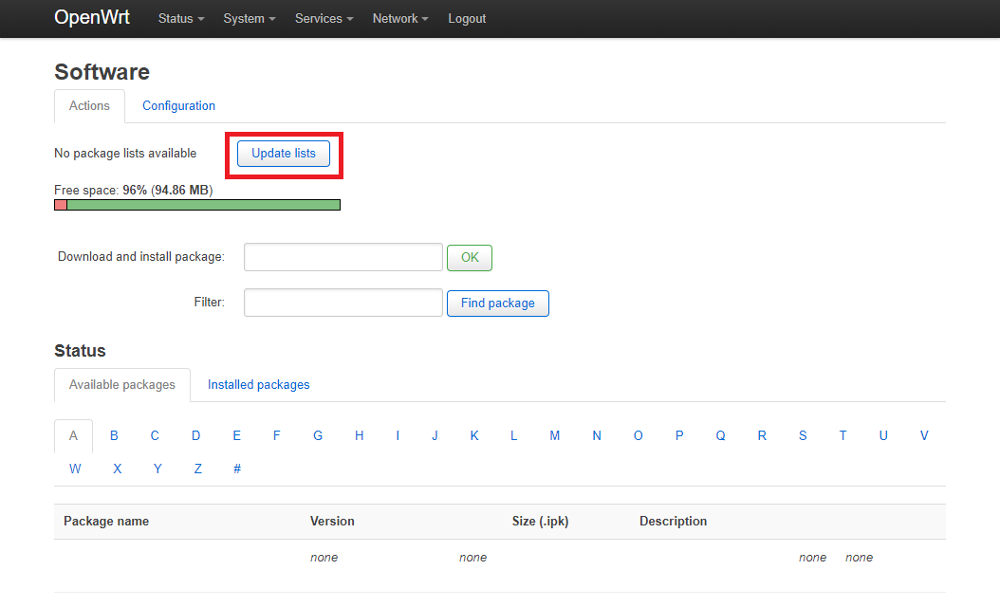
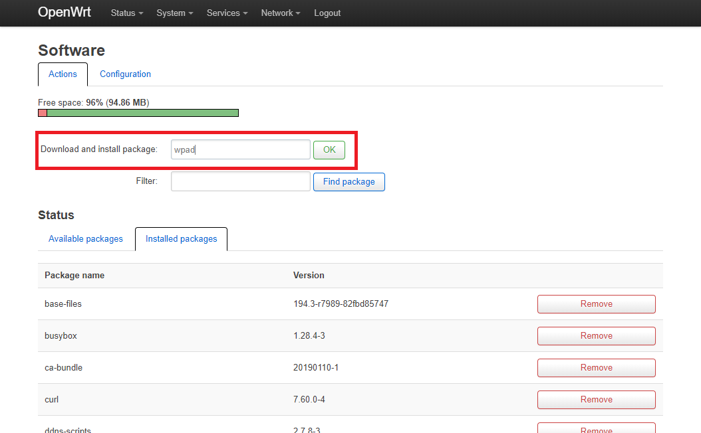
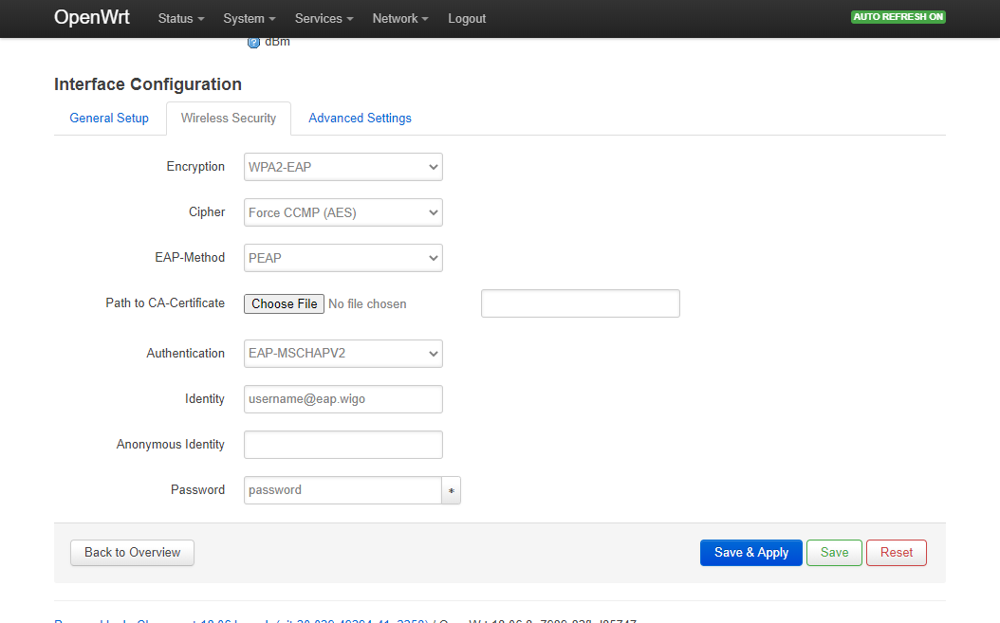

### Tutorial untuk terkoneksi dengan sinyal seamless<span></span>@wifi.id

Apabila sinyal @wifi.id lain tidak memerlukan paket khusus untuk bisa terkoneksi dengan jaringan, seamless<span></span>@wifi.id perlu menggunakan paket **wpad** agar bisa terkoneksi.

Kelebihan sinyal seamless<span></span>@wifi.id ketimbang sinyal @wifi.id lainnya adalah tidak perlu login ulang dalam selang waktu tertentu atau jika tidak dipakai dalam waktu tertentu.

> :warning: **Perhatian!** paket **wpad** membutuhkan ukuran ruang kosong yang lebih besar daripada paket **wpad-mini**/**wpad-basic**, pastikan router anda memiliki ruang yang cukup sebelum melanjutkan.

> :loudspeaker: Langkah-langkah di bawah hanya bisa dilakukan jika router sudah dalam keadaan online! Jika belum pernah online, bisa diakali dengan konek ke jaringan @wifi.id biasa terlebih dahulu (beli voucher Rp 5.000), baru kemudian konek ke seamless<span></span>@wifi.id.

#### Pembelian Akun seamless<span></span>@wifi.id

Pembelian akun seamless<span></span>@wifi.id hanya bisa dilakukan melalui aplikasi wifi.id GO ([android](https://play.google.com/store/apps/details?id=com.telkom.wifiidgo), [iOS](https://apps.apple.com/id/app/wifi-id-go/id1198078195)) atau melalui aplikasi myIndihome (aktivasi add-on seamless) ([android](https://play.google.com/store/apps/details?id=com.telkom.indihome.external), [iOS](https://apps.apple.com/id/app/myindihome/id1119407221))

#### Langkah-Langkah

1. Koneksikan perangkat (PC/laptop) ke router (biasanya [192.168.1.1](http://192.168.1.1))

   

2. Buka tab **System** -> **Software**

3. Lakukan pembaruan daftar aplikasi dengan menekan tombol **Update lists**

   

4. Tunggu sampai proses pembaruan daftar selesai

   

5. Buka tab **Installed Packages**

6. Scroll ke bawah dan cari paket **wpad-basic** atau **wpad-mini**, lalu tekan tombol **remove** yang ada di sampingnya

   

7. Scroll ke atas lagi, lalu isikan `wpad` di bagian **Download and install package**, lalu tekan tombol OK

   

8. Buka tab **Network** -> **Wifi/Wireless**

   

9. Tekan tombol **Scan**

10. Pilih jaringan seamless<span></span>@wifi.id dengan menekan tombol **Join Network** di sisi kanan nama jaringan.

   

11. Biarkan pengaturan bawaan dari OpenWrt/LEDE, langsung tekan **Submit**

   

12. Anda akan dibawa ke pengaturan wifi, buka tab **Wireless Security** dan sesuaikan isinya dengan contoh berikut:

   ```
   Wireless Security
   
   Encryption: WPA2-EAP
   Cipher: Force CCMP (AES)
   EAP-Method: PEAP
   Path to CA-Certificate: <dikosongi>
   Authentication: EAP-MSCHAPV2
   Identity: <diisi sesuai dengan username dari pembelian voucher>
   Anonymous Identity: <dikosongi>
   Password: <diisi sesuai dengan password dari pembelian voucher>
   ```

   

13. Tekan tombol **Save and Apply**