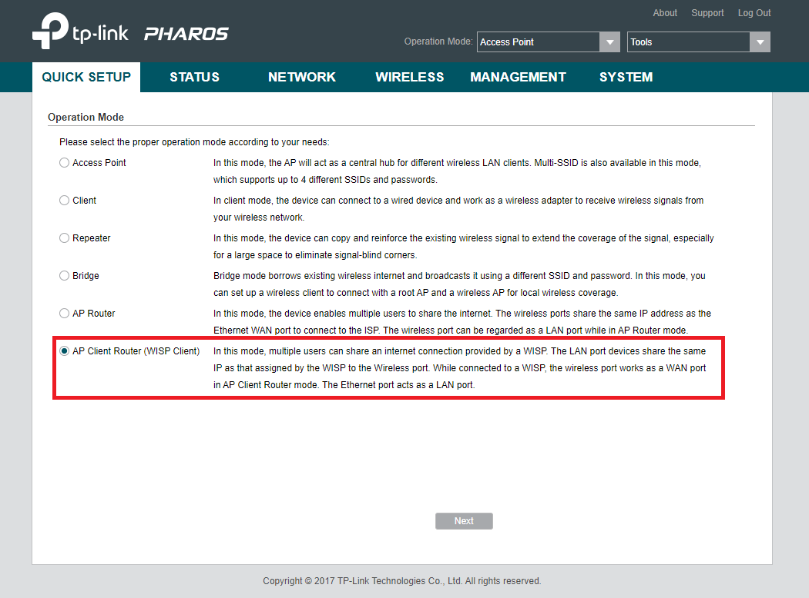
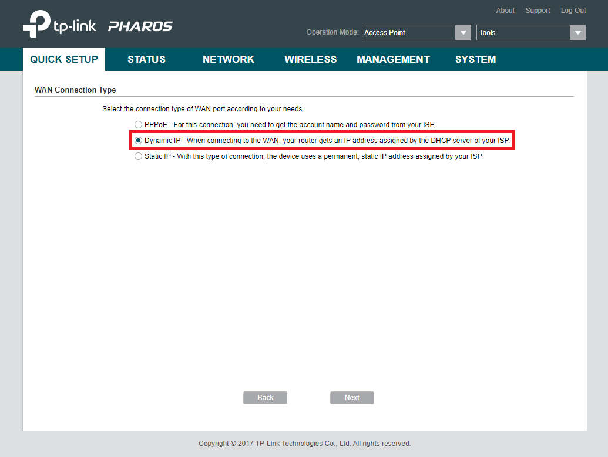
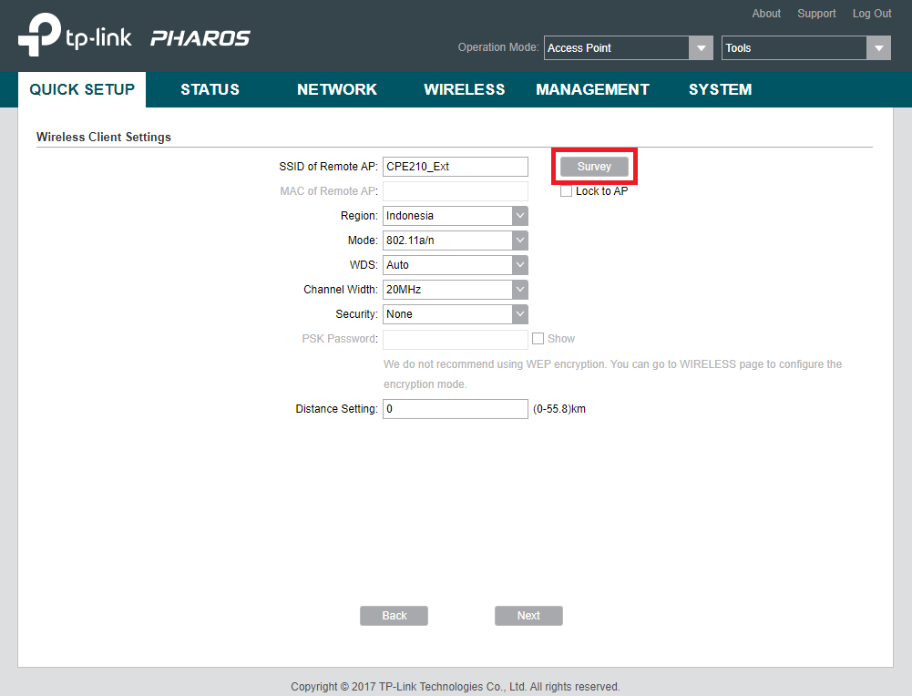
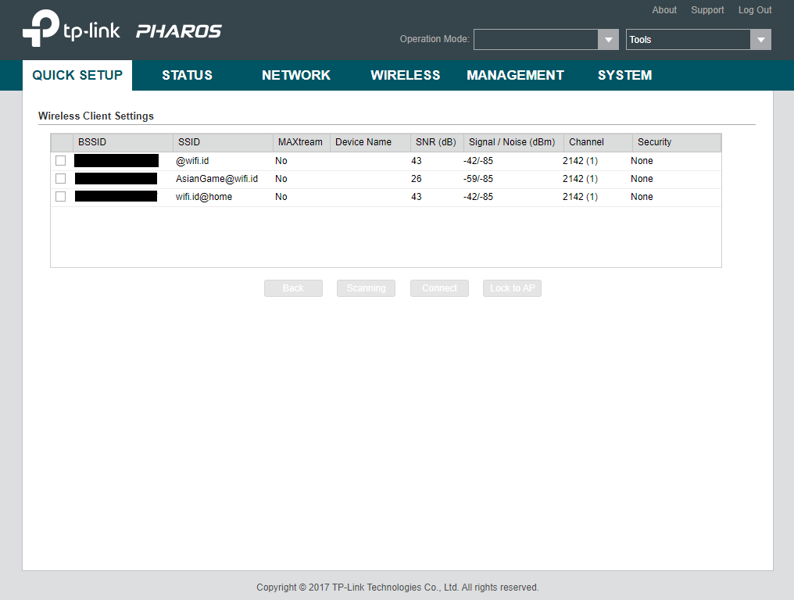
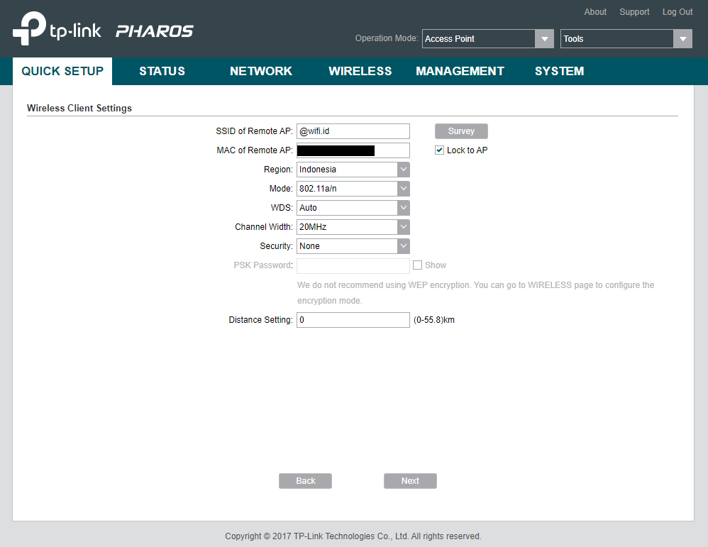
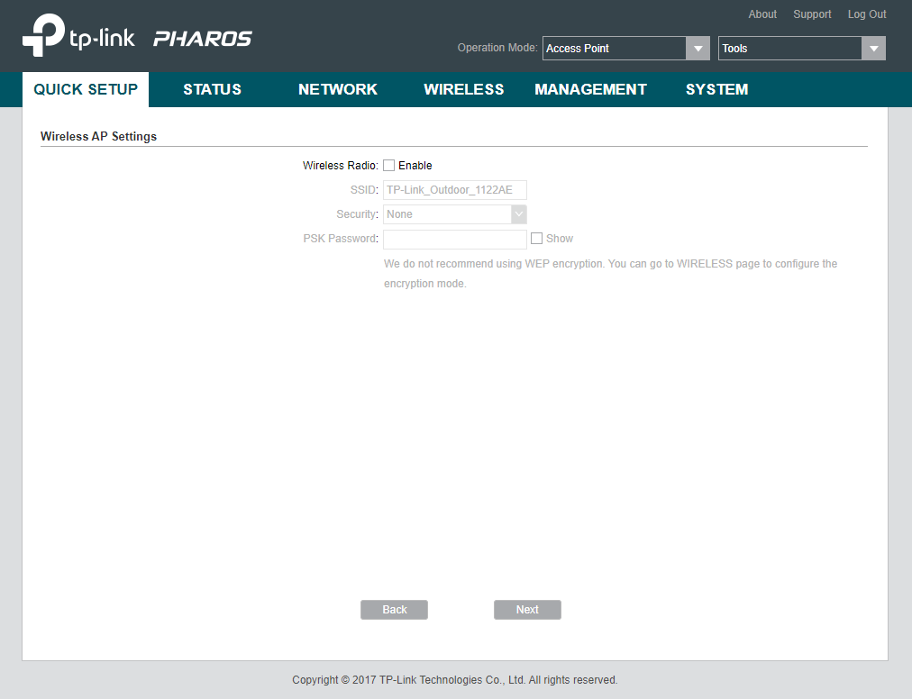
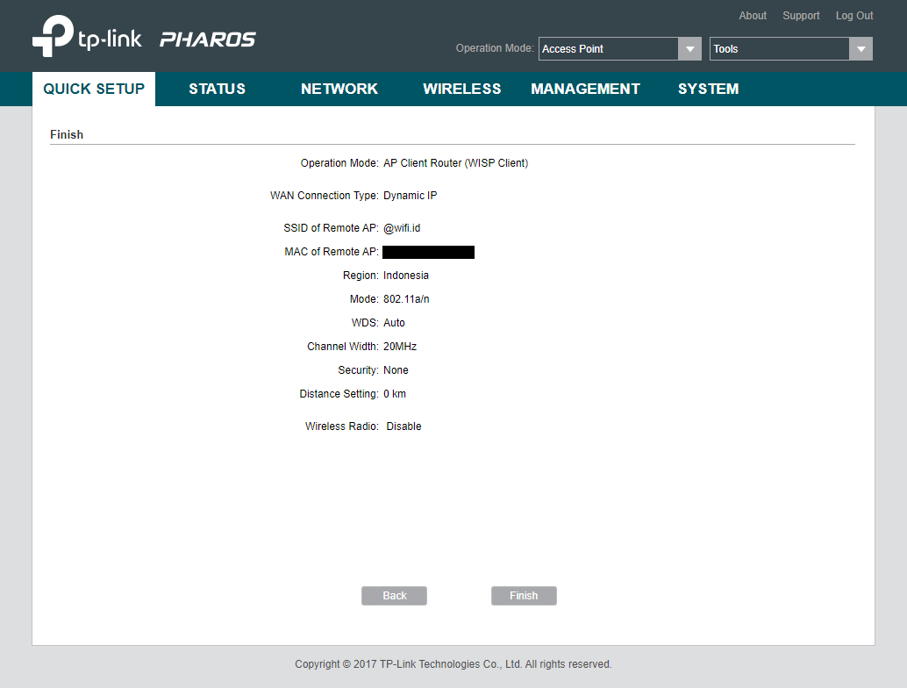
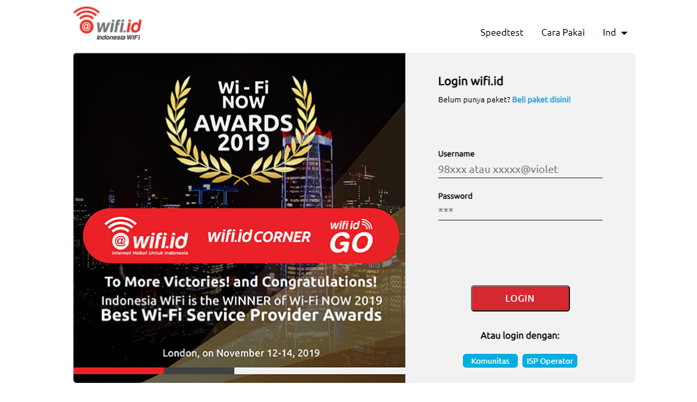
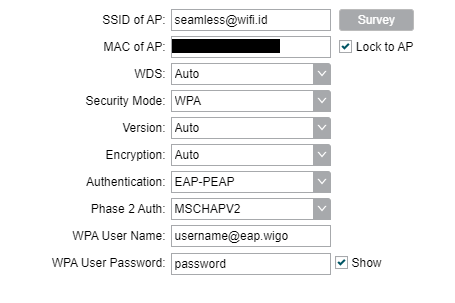

### **Tutorial Untuk Menangkap dan Memancarkan Kembali Sinyal @wifi.id Menggunakan TP-Link Pharos**

Pengguna produk TP-Link berbasis Pharos (tipe CPE210/220, CPE510/520, CPE605 dan CPE610) juga bisa memanfaatkan sinyal @wifi.id untuk dipakai bersama.

> :warning: Firmware Pharos keluaran lama mungkin tidak mendukung koneksi ke sinyal seamless<span></span>@wifi.id, perbarui firmware anda bila perlu.

### **Langkah-Langkah**

1. Koneksikan perangkat (PC/laptop) ke router (biasanya [192.168.0.254](http://192.168.0.254))

2. Di halaman utama, masuk ke tab **QUICK SETUP**

3. Pilih mode **AP Client Router (WISP Client)**, lalu tekan tombol **Next**



4. Pilih **Dynamic IP**, lalu tekan tombol **Next**



5. Tekan tombol **Survey**



6. Pilih sinyal/SSID @wifi.id, lalu tekan **Lock to AP**

> :loudspeaker: Pilih salah satu sesuai kebutuhan dan ketersediaan di daerah anda: @wifi.id, Indischool<span></span>@wifi.id, AsianGame<span></span>@wifi.id, seamless<span></span>@wifi.id, wifi.id<span></span>@home



7. Pastikan pengaturannya sudah sesuai sebelum menekan tombol **Next**, bisa merujuk ke contoh berikut:

   ```
   SSID of Remote AP: <nama sinyal @wifi.id>
   MAC of Remote AP: <MAC sinyal @wifi.id>
   Lock to AP: Dicentang
   Region: Indonesia
   Mode: <dibiarkan sesuai bawaan>
   WDS: Auto
   Channel Width: 20MHz
   Security: None
   ```



8. Di halaman **Wireless AP Settings**, saya sarankan untuk dimatikan saja, kecuali ada keterbatasan dana yang menyebabkan tidak bisa menggunakan 2 router terpisah untuk menangkap dan memancarkan kembali sinyal @wifi.id, karena kecepatan koneksi akan berkurang 50%. Jika sudah, tekan tombol **Next**.



9. Konfirmasi pengaturan sudah tepat, lalu tekan **Next**



10. Anda akan dibawa kembali ke halaman utama, dan halaman login akan muncul




### **Pengaturan untuk seamless<span></span>@wifi.id**

Untuk sinyal seamless<span></span>@wifi.id, bisa merujuk ke contoh berikut:

   ```
   SSID of AP: seamless@wifi.id
   MAC of AP: <MAC sinyal seamless@wifi.id>
   Lock to AP: Dicentang
   WDS: Auto
   Security Mode: WPA
   Version: WPA2
   Encryption: AES
   Authentication: EAP-PEAP
   Phase 2 Auth: MSCHAPV2
   WPA User Name: <diisi sesuai dengan username dari pembelian voucher>
   WPA User Password: <diisi sesuai dengan password dari pembelian voucher>
   ```

